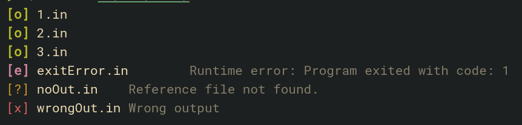

# ${\color{Dandelion}Themulator}$
A cli demake of Themis, the programing judge.

## Install steps
```
git clone https://github.com/Bgabri/Themulator
cd Themulator
mkdir build
cd build
cmake ..
make
make install
```


## Usage

Our coding monkies do not guaranty the functionality of Themulator on non linux based systems.

To ensure Themulator works as intended in your project folder include a `in` and `ref` folder for the input and reference output of the testcases. The extension of the input files should end with `.in`. additionally its matching reference output should be named the same with `.out` as its extension, as shown below.
```
src/
|- in/
|  |- 1.in
|  |- 2.in
|
|- ref/
|  |- 1.out
|  |- 2.out
|
|- main.c

```

Then simply run `thml`.

### options
```
Usage: thml [options]
Options:
    --help, -h
        Display this information
    --dry-run, -d
        run without command execution
    --verbose
        print out all the execution steps
    --valgrind, -v
        runs the binary through valgrind
    --bin-name <name>, -b <name>
        the name to give to the outputted binary
    --dir <folder>, -D <folder>
        the folder of the source files to judge
    --in-dir, -I <folder>
        the folder to the input of the test cases
    --out-dir <folder>, -O <folder>
        the folder where the output is placed
    --bin-dir <folder>, -B <folder>
        the folder to output the binaries to
    --ref-dir <folder>, -R <folder>
        the folder with the reference outputs of the test cases
```

## Example
An example of running `thml` in `src/Test`.

